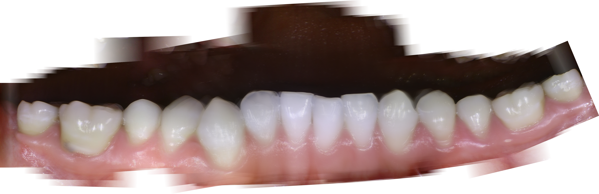

  <h1>Dental Panorama Image Processing</h1>
  
<b>Flattening a U-shaped Dental Arch into a 2D Panorama</b>

 

## Visual Result

  

 

## Project Overview

* **Objective:** Developed an algorithm to analyze U-shaped dental arch data and flatten it into a straight, 2D panoramic image.
* **Key Challenge:** Estimating the central curve of the dental arch and precisely remapping pixels to minimize geometric distortion during the unwrapping process. Due to the low performance of dental computers, we only used Dual CPUs (GPU X).

 
